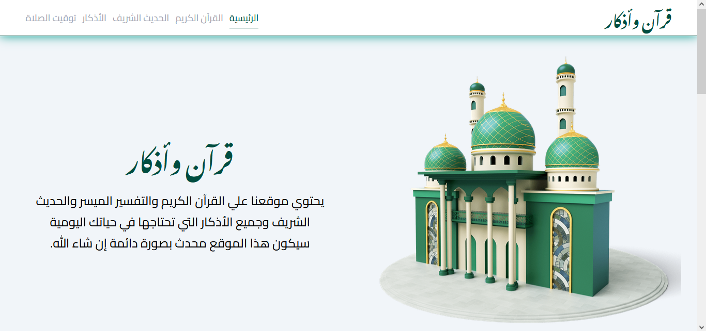
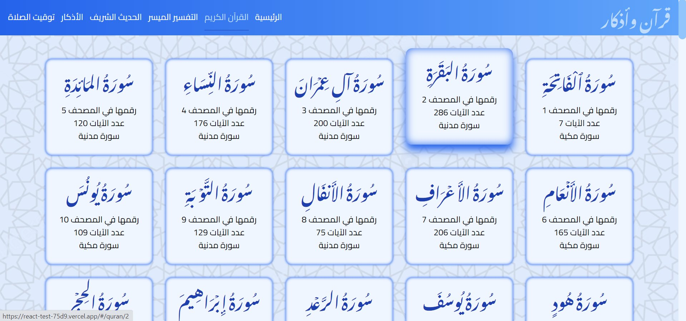
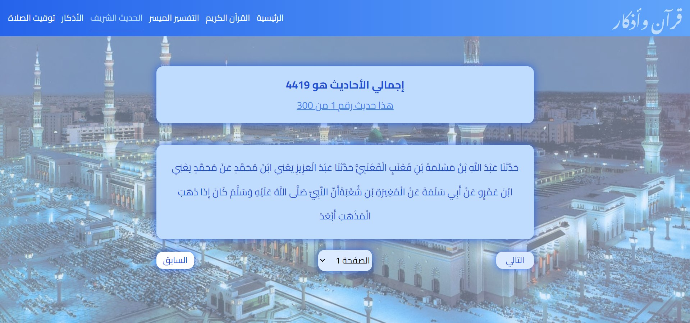
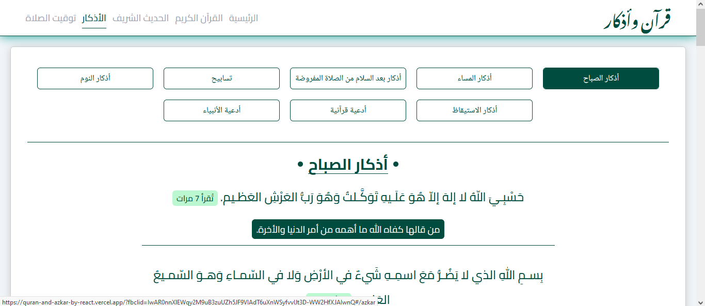
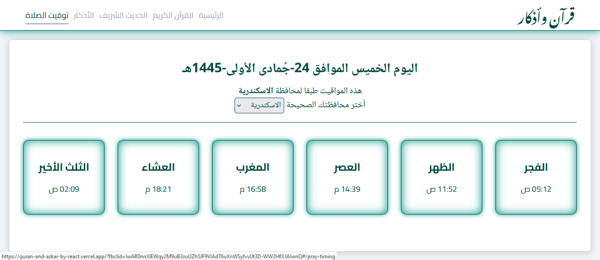
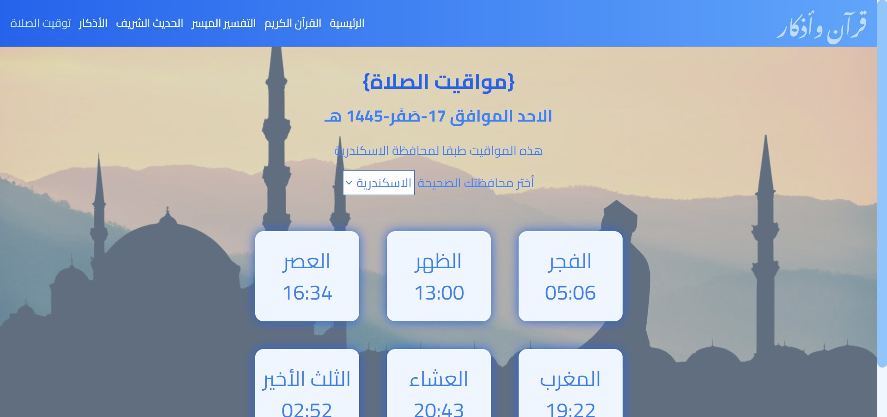

# Quran And Azkar قرآن وأذكار

## The new version is here ^^

Here I changed the design and removed the Tafsir section and relied solely on explaining the verse in the Quran section.
I used Typescript with React

## What is Quran And Azkar?

This is My first project with react, react-router-dom, redux, react-redux, axios, Emailjs and tailwind, This website contains the Noble Qur’an, interpretation of the Qur’an, Hadith, morning and evening remembrances, supplications of the Prophets from the Qur’an, praises, and much more. There is also a personal page where you can obtain guidance on reading the Qur’an and know where you left off.

## About Me

I'm Ahmed Magdy I'm Fronend Developer.

## What did i use to build this application?

### New version :

I used Vite + React with Typescript, Tailwind for styling, React Context, I used emailjs with the form in main page, finally i used axios to fetch data.

### old version :

I used Vite + react, Tailwind for styling, redux to manage the global state, react-redux to connect the app with the redux store, I used emailjs with the form in main page, finally i used axios to fetch data.

### Quran Kareem

#### New:

#### Old :

This section contain all of sorahs from api and there is the tafsir too .

### Tafsir Section

In this section there is the tafsir if you want read Quran with tafsir.

### Hadeeth Shareef

Here there is hadeeth shareef section there is more than 4000 hadeeth you will find what you whant here inshaa allah.

### Azkar

#### New :

#### Old :

Here there are many supplications, including morning and evening supplications, supplications from the Quran, supplications of the prophets, and many many supplications.

## Pray Timing

#### New :

#### Old:

## Links

- Facebook
  https://www.facebook.com/profile.php?id=100085749470017

- X
  https://twitter.com/ahmed_magdy135
